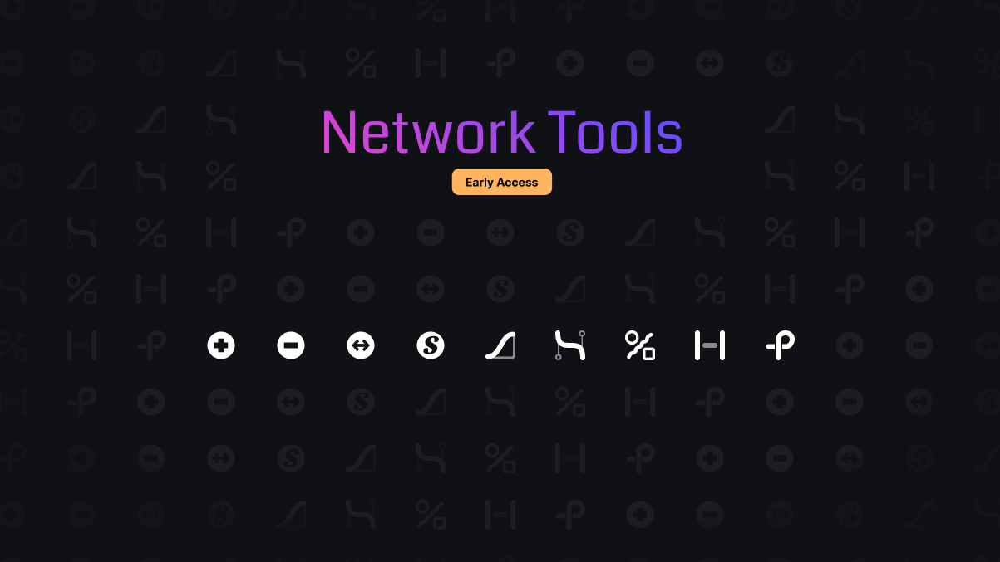

# Network Tools for Cities: Skylines II



**Network Tools** gives you precise control over every network in your city: roads, paths, rail, and waterways. Add or remove nodes, reshape slopes and curves, generate grids, and more, with interactive 3D handles and real-time previews.

It is the spiritual successor to [Network Multitool](https://steamcommunity.com/sharedfiles/filedetails/?id=2560782729) for Cities: Skylines 1, rebuilt from the ground up for CS2.

[Paradox Mods](https://mods.paradoxplaza.com/mods/133736/Windows) · [Forum thread](https://forum.paradoxplaza.com/forum/threads/network-tools-early-access.1927685/) · [Discord](https://discord.gg/C2XQUYHwuV) · [Crowdin](https://crowdin.com/project/networktools-cs2) · [Ko-fi](https://ko-fi.com/lucadevdesign)

> [!WARNING]
> **Early access.** Not every feature is finished, updates can be frequent, and you may run into issues. The mod is generally stable, but **back up your save** before you use it.

## Tools

### Node tools
| Tool | Description |
| --- | --- |
| **Add Node** | Click any edge to insert a new node, splitting the segment in two. |
| **Remove Node** | Click a node to remove it and merge its two adjacent segments. |
| **Slide Node** *(coming soon)* | Drag a node along its connected edges without changing the curve's shape. |
| **Super Node** | Select several nearby nodes and merge them into a single large intersection. |

### Shape tools
| Tool | Description |
| --- | --- |
| **Slope** | Reshape the elevation profile of a path: constant slope, ease-in/out, or arch. |
| **Curve** | Straighten or smooth the horizontal curve of a path. |

### Creation tools
| Tool | Description |
| --- | --- |
| **Connect** | Connect two nodes with a simple curve, complex curve, or loop. |
| **Parallel** | Create a parallel copy of an existing path at an adjustable offset. |
| **Generate** | Generate new networks from scratch, such as grids or circles and ovals. |

## Features
- **Real-time preview:** see the result of every change before you apply it.
- **Interactive handles and parameters:** drag handles in the world or adjust values in the sidebar.
- **Network filtering:** choose which network types to target: roads, paths, rail, waterways, or invisible paths.
- **View options:** toggle underground view, the zone grid, and invisible network visibility.
- **Keyboard shortcuts:** select tools with `Shift+1` to `Shift+9`, toggle the panel with `Shift+T`, and apply with `Enter`. You can rebind all of them in the settings.

## How to use
1. Subscribe to the mod on [Paradox Mods](https://mods.paradoxplaza.com/mods/133736/Windows). It requires [Unified Icon Library](https://mods.paradoxplaza.com/mods/74417/Windows).
2. In game, open the **Network Tools** panel from the toolbar, or press `Shift+T`.
3. Pick a tool from the sidebar.
4. Click nodes or edges in the world to select them, adjust the handles and parameters, then apply.

## Support
For help and feedback, join the [CS2 Modding Discord](https://discord.gg/C2XQUYHwuV).

When you report a bug, please share your logs and playset with **Skyve**. A copy of your save helps a lot too. Without logs, most bugs are very hard to fix.

## Translations
Translations are managed on [Crowdin](https://crowdin.com/project/networktools-cs2). To help translate the mod into your language, join the project there or ask on the [Discord](https://discord.gg/C2XQUYHwuV).

## Development

### Requirements
- Cities: Skylines II with the official modding toolchain installed (it sets the `CSII_TOOLPATH` environment variable)
- .NET SDK and .NET Framework 4.8 targeting pack (see below on Windows)
- Node.js 18 or later, for the UI: run `npm install` once in `NetworkTools.Mod/UI`
- Mono, optional on Windows, to run every test outside the game (`winget install Mono.Mono`, see Testing)

Without the targeting pack the mod does not compile: `CS0518`, the SDK falling back to a reference `mscorlib` without `ReadOnlySpan`. With Visual Studio 2022 Community, from an administrator PowerShell:

```powershell
& "C:\Program Files (x86)\Microsoft Visual Studio\Installer\setup.exe" modify --installPath "C:\Program Files\Microsoft Visual Studio\2022\Community" --add Microsoft.Net.Component.4.8.TargetingPack --passive
```

Without Visual Studio, install the [.NET Framework 4.8 Developer Pack](https://dotnet.microsoft.com/download/dotnet-framework/net48).

### Getting started
Clone the repository with its submodules:

```bash
git clone --recurse-submodules https://github.com/lucarager/CS2-NetworkTools.git
```

Build the solution, or run `dotnet build` in `NetworkTools.Mod/`:

```bash
dotnet build CS2-NetworkTools.sln
```

The build generates the UI parameter bindings, builds the TypeScript/React UI in `NetworkTools.Mod/UI`, and deploys the mod to your local mods folder.

### Repository layout
| Path | Contents |
| --- | --- |
| `NetworkTools.Mod/` | The mod itself: ECS systems, components, settings, and localization |
| `NetworkTools.Mod/Systems/Tools/` | One folder per tool, each extending `NT_BaseToolSystem` |
| `NetworkTools.Mod/UI/` | The in-game UI (TypeScript/React, Colossal UI) |
| `NetworkTools.Mod/Common/` | Shared library ([CS2-LucaModsCommon](https://github.com/lucarager/CS2-LucaModsCommon)), included as a submodule |
| `NetworkTools.Codegen/` | Generates `parameters.generated.ts` from the C# tool parameters |
| `NetworkTools.Tests/` | NUnit tests |

To regenerate the UI parameter bindings without a full build:

```bash
dotnet run --project NetworkTools.Codegen -- "NetworkTools.Mod\Systems" "NetworkTools.Mod\UI\src\generated\parameters.generated.ts" --configuration Release
```

### Testing

Tunnel mode has two sets of tests: unit tests that run outside the game in seconds, and a scenario that the game's own test runner plays on a terrain made for it.

#### Outside the game

`NetworkTools.Tests/` is an NUnit project that references the mod. Run it after a mod build (`dotnet build -c Release` in `NetworkTools.Mod/`).

**Linux**, from `NetworkTools.Tests/`:

```sh
dotnet test -c Release -p:BuildProjectReferences=false
MONO_ENV_OPTIONS=-O=-float32 dotnet test -c Release -p:BuildProjectReferences=false
```

**Windows**, from the repository root:

```bat
.\NetworkTools.Tests\test.cmd
```

`test.cmd` runs both passes under Mono, with NUnit's console runner. Without Mono it falls back to `dotnet test`. Set `MONO` to the path of `mono.exe` when Mono is not in `C:\Program Files\Mono`.

- **`-p:BuildProjectReferences=false`** skips building and deploying the whole mod, which a plain `dotnet test` does first.
- **Why Mono.** `dotnet test` runs `net48` on Mono on Linux, and on the .NET Framework on Windows. Most tests allocate Unity's native collections, whose memory functions the game implements in native code. Mono lets the test process supply them (`NativeAllocations.cs`); the .NET Framework cannot even load Unity's collections, so there those tests skip themselves with a reason.
- **Why two passes.** `TunnelRuns` runs in Burst jobs, which compute `float` in single precision, and on the main thread under the game's Mono, which computes it in double precision. A system Mono computes it in single precision by default; `-O=-float32` switches it to double.

#### In the game

`NetworkTools.Mod/Tests/` holds the scenario "NetworkTools: Tunnel mode". It opens the editor on a new map, puts a proving ground under it (a terrain made by formulas, one lane for each family of cases), lays networks along the lanes with the Connect, Slope and Parallel tools, and checks where the mouths are, previewed and built. Leave the game alone for the few minutes it takes. It puts the tools' saved parameters back when it ends.

The mod registers its scenarios with the game's runner in a Debug build only, where its jobs are not Burst-compiled:

```sh
cd NetworkTools.Mod
dotnet build -c Debug
```

Then start it from the main menu, in one of three ways:

- **Automatic start.** Launch the game with `--categoryFilter=QA`. Five seconds after the main menu first shows, the game runs every scenario of that category: this one alone, since none of the game's carries it.
- **Developer menu.** Launch the game with `-developerMode -qaDeveloperMode`. The developer menu gets a Test Scenarios tab, with a button for each scenario under its category: this one is under QA.
- **From a debugger.** Evaluate `Colossal.TestFramework.TestScenarioSystem.instance.RunScenario("NetworkTools: Tunnel mode", System.Threading.CancellationToken.None)`.

The results are in `Logs/TestScenarios.log`, in the game's user data folder: a line for each check (`PASSED`, `FAILED`, or `KNOWN` for a fault of the game's, reported without failing the test), the counts of each test, and `FINISH TEST SCENARIO` with the outcome. The runner counts the tests' own errors only: a scenario that fails to load its map runs no test and still ends in a Success, so read the counts.

Build `-c Release` again afterwards to play.

## Support the project
If you'd like to support development, you can do so on [Ko-fi](https://ko-fi.com/lucadevdesign). Thank you!

## License
Released under the MIT License. See [LICENSE.txt](LICENSE.txt).
